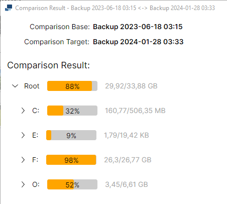
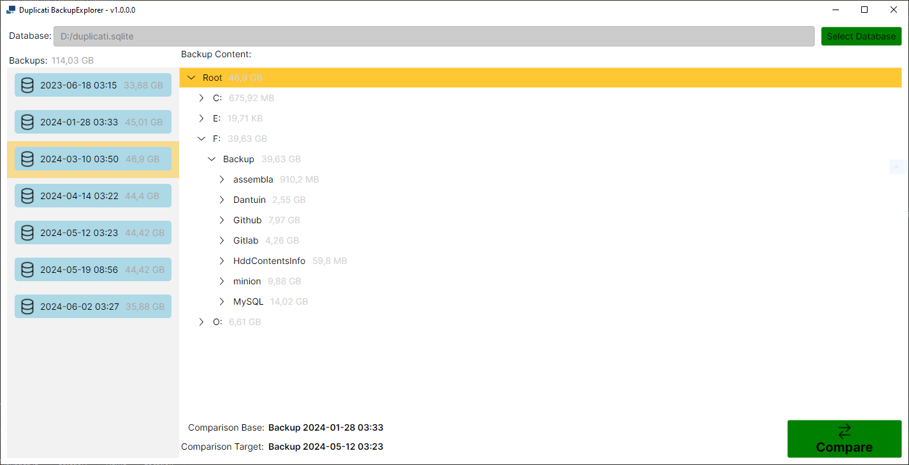
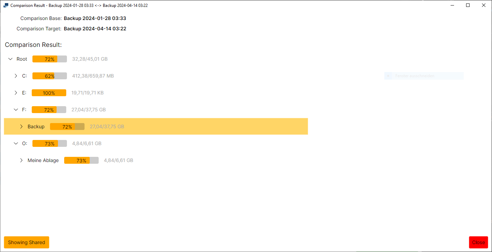

# Duplicati BackupExplorer

Duplicati BackupExplorer is a .NET desktop application built with C# using Avalonia UI. The application allows users to load a Duplicati database SQlite file and explore all backups contained within. Users can view the contents of backups, including directories and individual files, and compare different items to analyze data similarities.

Duplicati is using a deduplication process to minimize the data that has to be uploaded and stored. This is done by detecting blocks of data that are identical in different backup versions. Key feature of this application is exploring Duplicati's data dedulication mechanics by inspecting how much data and which data is shared between different backups and how much additional disk space is needed for specific backups.

## Features

- **Load Duplicati Database Files**: Open and explore `.sqlite` database files generated by Duplicati.
- **View Backups**: Display all backups within the loaded database, including their hierarchical structure.
- **Item Comparison**: Compare two items (backups, directories, or files) to see how much data on is inclthe left side is present in the right side item.
- **Comparison Metrics**: Provides a percentage indicating the overlap of data between the selected items.

## Supported Operating Systems
* Linux
* Windows


## Usage

### Loading a Database

1. Launch the Duplicati BackupExplorer application.
2. Click on the button `Select Database`.
3. Browse to the location of your Duplicati database file (on Windows `%USERPROFILE%\AppData\Local\Duplicati` and Lon inux it's `~/.config/Duplicati`) and open it.

### Exploring Backups

- Once the database is loaded, the application will display a list of all backups within the database in the left pane.
- Click on any backup to show its contents. You can drill down into directories and view individual files.

### Comparing Items

Different items can be compared. An item is either a whole backup from the left pane or an individual file or directory inside a backup from the content pane.

The comparison can only be performed after both comparison items have been selected. Otherwise the button `Compare` will not be available.

The comparison works by analyzing how many blocks and how much data of the comparison base is also contained in the comparison target. The result of the comparison will be displayed in a new window.
The results can be seen for every individual file or directory.

1. Select the first item as comparison base. Right-click on an item an select `Select as Comparison Base`.
2. Select the second item as left side of the comparison. Right-click on an item an select `Select as Comparison Target`.
3. The application will display a comparison percentage, indicating how much data from the left item is present in the right item.

The percentage display can be inverted to show the amount of disjunct data (instead of the amount of shared data) by using the buttons `Showing Shared` or `Showing Disjunct`. 

### Example
This is an example of how a result window could look:



What are we seeing here? This is the result of the comparion with backup `2023-06-18 03:15` to backup `2024-01-28 03:33`.

The node `Root` shows information about the whole content, not specific to individual folder or directories. The result here means that 88% of the data (29.92 GB) in the backup `2023-06-18 03:15` is also contained in the backup `2024-01-28 03:33`.
In the same way, there is the information for folders and files which are part of the `Root` node.

## Screenshots


*Description of an item comparison.*


*Description of the main interface.*

## Compiling

1. Clone the repository:

    ```bash
    git clone https://github.com/your-username/DuplicatiBackupExplorer.git
    ```

2. Build the project:

    - Open the project in your preferred C# IDE (e.g., Visual Studio, JetBrains Rider).
    - Restore the necessary NuGet packages.
    - Build the solution.
    - (Alternatively to the instructions above: run command `dotnet build`)

3. Run the application:

    - After building, run the application from your IDE or by executing the compiled binaries.


## License

This project is licensed under the MIT License. See the [LICENSE](./LICENSE.md) file for details.

## Support

If you encounter any issues or have any questions, feel free to open an issue on this repository.

## Acknowledgements

- [Avalonia](https://avaloniaui.net/) for providing the cross-platform UI framework.
- [Duplicati](https://www.duplicati.com/) for the backup solution that inspired this project.
- [System UIcons](https://icon-icons.com/de/users/5PGZHjZSj9HEiyvBCqjy5/icon-sets/) for UI icons used in this application.
