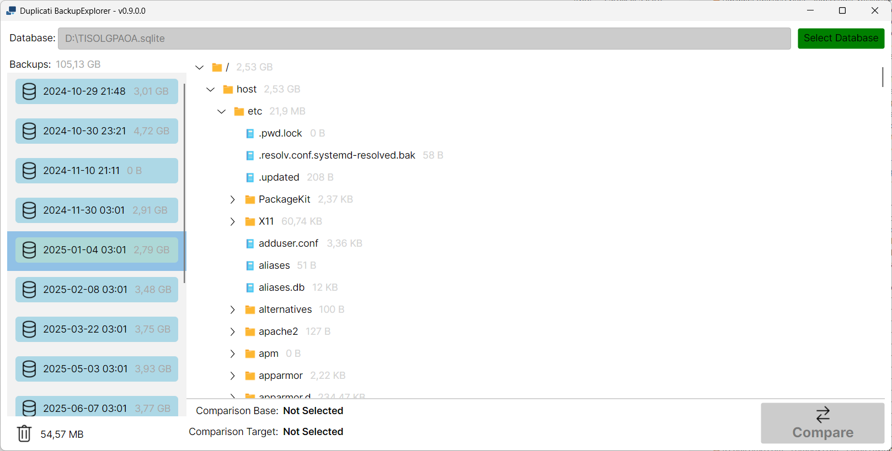
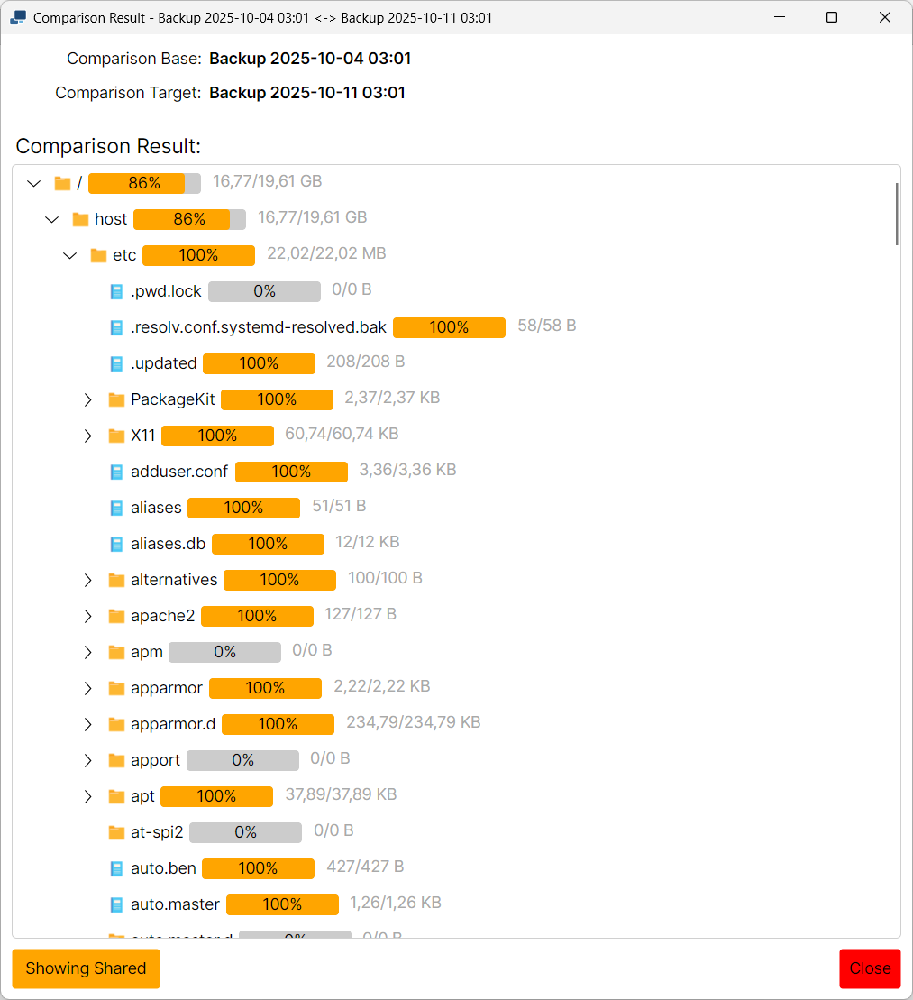
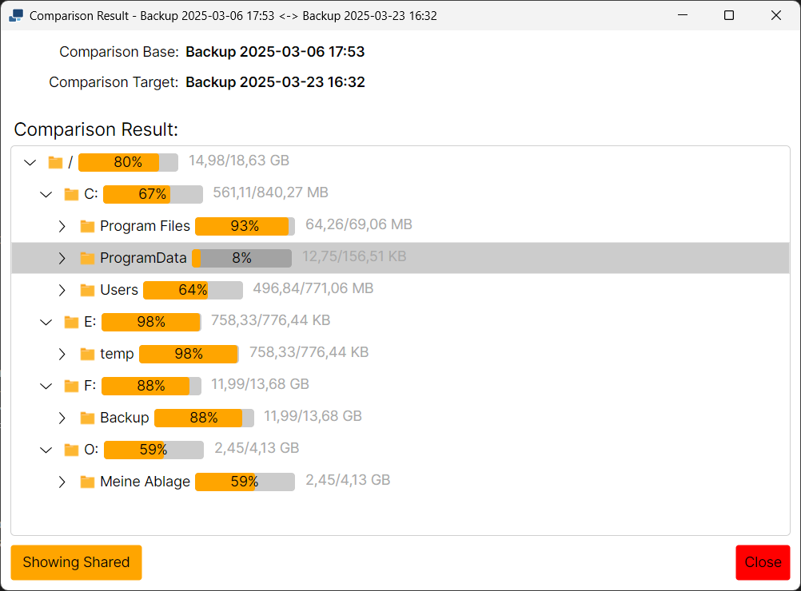

# Duplicati BackupExplorer

Duplicati BackupExplorer is a .NET desktop application built with C# using Avalonia UI. The application allows users to load a Duplicati database `.sqlite` file and explore all backups contained within. Users can view the contents of backups, including directories and individual files, and compare different items to analyze data similarities.

Duplicati is a powerful backup tool, but it can be challenging to understand how its deduplication works and how much space each backup is actually consuming. Duplicati BackupExplorer solves this by providing a user-friendly interface to explore your backup databases, visualize data overlap, and see exactly what's new in each backup version.

## Screenshots


*The main window, showing a list of backups and the contents of a selected backup.*


*The comparison window, showing a detailed breakdown of data shared between two backups.*


## Features

-   **Load Duplicati Database Files**: Open and explore `.sqlite` database files generated by Duplicati.
-   **View Backups**: Display all backups within the loaded database, including their hierarchical structure.
-   **Item Comparison**: Compare two items (backups, directories, or files) to see how much data is shared between them.
-   **Comparison Metrics**: Provides a percentage indicating the overlap of data between the selected items.


## Supported Operating Systems
* Linux
* Windows


## How to Use

### 1. Loading a Backup Database

1.  Launch the Duplicati BackupExplorer application.
2.  Click the **Select Database** button.
3.  Navigate to your Duplicati database files.
    * **Windows:** `%USERPROFILE%\AppData\Local\Duplicati`
    * **Linux:** `~/.config/Duplicati`
4.  Select one of the randomly named `.sqlite` files. Each of these files represents one of your Duplicati backup jobs. **Do not** select `Duplicati-server.sqlite`.

### 2. Exploring Backups

* Once loaded, a list of all backups will appear in the left-hand pane.
* Click on a backup to view its contents in the right-hand pane. You can navigate through folders and see individual files.
* Right-click on the column headers to sort by name or size.
* Backups that have been loaded are cached in memory for faster access and will be highlighted in light green.


### 3. Comparing Backups, Folders, or Files

The core feature of Duplicati BackupExplorer is its ability to compare two items to see how much data they share. An "item" can be an entire backup, a folder within a backup, or a single file. The comparison can only be performed after both comparison items have been selected. Otherwise the button Compare will not be available.

1.  **Select the Base Item:** Right-click on the first item you want to compare and select **Select as Comparison Base**.
2.  **Select the Target Item:** Right-click on the second item and select **Select as Comparison Target**.
3.  **Compare:** The **Compare** button will become active. Click it to open the comparison window.

The comparison window shows you the content of the **base** item and what percentage of the data from the **base** item is also present in the **target** item. You can toggle to invert the percentag to show the amount of data **not** present in the **target** by clicking the **Showing Shared** / **Showing Disjunct** button.


### Example
This is an example of how a result window could look:



What are we seeing here? This is the result of a comparison of the backup `2025-03-06 17:53` as **base** with backup `2025-03-23 16:32` as **target**. The file tree always shows the content of the **base**.

The root node `/` shows information about the whole content, not specific to individual folder or directories. The whole base backup is 18.63 GB in size.80% of this data (which is 14.98 GB) in the base backup `2025-03-06 17:53` is also contained in the target backup `2025-03-23 16:32`.
In the same way, there is this kind of information for all individual folders and files which are part of the base backup.
When clicking the "Showing Shared" button, you get the same kind of information but inverted: it will be displayed how much of the base data is *not* included in the target.


## Compiling

1. Clone the repository:

    ```bash
    git clone https://github.com/your-username/DuplicatiBackupExplorer.git
    ```

2. Build the project:

    - Open the project in your preferred C# IDE (e.g., Visual Studio, JetBrains Rider).
    - Restore the necessary NuGet packages.
    - Build the solution.
    - (Alternatively to the instructions above: run command `dotnet build`)

3. Run the application:

    - After building, run the application from your IDE or by executing the compiled binaries.


## License

This project is licensed under the MIT License. See the [LICENSE](./LICENSE.md) file for details.

## Support

If you encounter any issues or have any questions, feel free to open an issue on this repository.

## Acknowledgements

- [Avalonia](https://avaloniaui.net/) for providing the cross-platform UI framework.
- [Duplicati](https://www.duplicati.com/) for the backup solution that inspired this project.
- [System UIcons](https://icon-icons.com/de/users/5PGZHjZSj9HEiyvBCqjy5/icon-sets/) for many UI icons used in this application.
- [mnauliady Stationary Icons](https://www.flaticon.com/packs/stationery-437) for the file and folder icons.